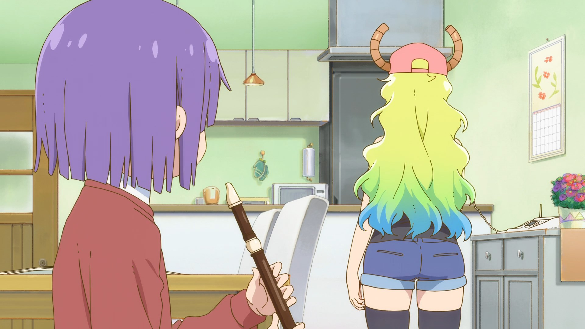

# Lucoa.js

###### *i got too much free time*
Random Node.js app that tries to create a video of Lucoa in rhythm to an osu! beatmap. An example can be found [here](https://youtu.be/BEmKtL-62DE).

Note that this project is not finished and will likely never be.

## To-do
- Sync the dance better
- Automatically add music
- Add hitsounds


## Usage

#### Prerequisites

- Node.js v12
- FFmpeg v4.4+
```bash
git clone https://github.com/LiterallyFabian/Lucoa.git
cd Lucoa
npm install
```
To generate a video run `node index.js [.osu file path]`.

Your osu! beatmaps can probably be found at `C:\Users\<Username>\AppData\Local\osu!\Songs`

## Briefly how it works
- The app goes through your beatmap and makes a list of all objects
- Calculates the difference in milliseconds between each object
  - **diff =< 1000**
    - A clip with the length of the difference rounded to the closest 50 gets added to a list
    - If the global offset is too big the clip length might be modified
  - **diff > 1000**
     - A pause intro clip will be added to the list, then a pause image for the duration of the pause
- Use FFmpeg to concatenate the clips added to the list to make the final video. No automatically added audio yet.
